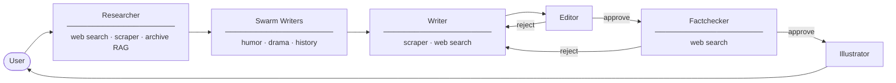

```mermaid
flowchart LR
    User([User])
    Researcher["Researcher\n─────────────────────\nweb search · scraper · archive RAG"]
    Swarm["Swarm Writers\n─────────────────────\nhumor · drama · history"]
    Writer["Writer\n─────────────────────\nscraper · web search"]
    Editor[Editor]
    Factchecker["Factchecker\n─────────────────────\nweb search"]
    Illustrator[Illustrator]

    User --> Researcher
    Researcher --> Swarm
    Swarm --> Writer
    Writer --> Editor
    Editor -->|approve| Factchecker
    Editor -->|reject| Writer
    Factchecker -->|approve| Illustrator
    Factchecker -->|reject| Writer
    Illustrator --> User
```
