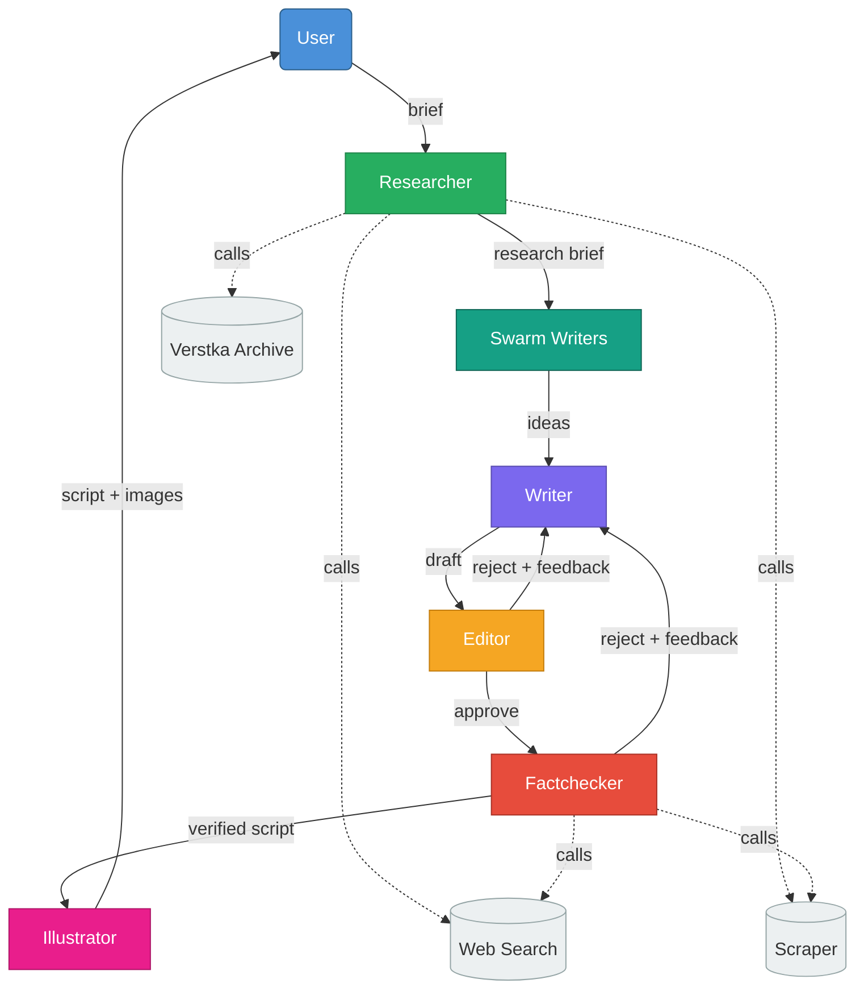

```mermaid
flowchart TD
    User(User) -->|brief| Researcher[Researcher]
    Researcher -->|research brief| Swarm[Swarm Writers]
    Swarm -->|ideas| Writer[Writer]
    Writer -->|draft| Editor[Editor]
    Editor -->|approve| Factchecker[Factchecker]
    Editor -->|reject + feedback| Writer
    Factchecker -->|reject + feedback| Writer
    Factchecker -->|verified script| Illustrator[Illustrator]
    Illustrator -->|script + images| User

    Researcher -.->|calls| WebSearch[(Web Search)]
    Researcher -.->|calls| Scraper[(Scraper)]
    Researcher -.->|calls| Archive[(Verstka Archive)]
    Factchecker -.->|calls| WebSearch
    Factchecker -.->|calls| Scraper

    style User fill:#4A90D9,stroke:#2C5F8A,color:#fff
    style Researcher fill:#27AE60,stroke:#1E8449,color:#fff
    style Swarm fill:#16A085,stroke:#0E6655,color:#fff
    style Writer fill:#7B68EE,stroke:#5A4DB0,color:#fff
    style Editor fill:#F5A623,stroke:#C47D0E,color:#fff
    style Factchecker fill:#E74C3C,stroke:#A93226,color:#fff
    style Illustrator fill:#E91E8C,stroke:#B01568,color:#fff
    style WebSearch fill:#ECF0F1,stroke:#95A5A6,color:#333
    style Scraper fill:#ECF0F1,stroke:#95A5A6,color:#333
    style Archive fill:#ECF0F1,stroke:#95A5A6,color:#333
```
