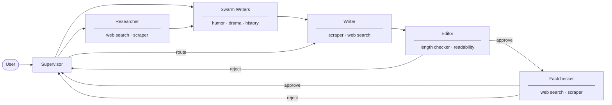

```mermaid
flowchart LR
    User([User])
    Supervisor[Supervisor]
    Researcher["Researcher\n─────────────────────\nweb search · scraper"]
    Swarm["Swarm Writers\n─────────────────────\nhumor · drama · history"]
    Writer["Writer\n─────────────────────\nscraper · web search"]
    Editor["Editor\n─────────────────────\nlength checker · readability"]
    Factchecker["Factchecker\n─────────────────────\nweb search · scraper"]

    User --> Supervisor
    Supervisor --> Researcher
    Supervisor --> Swarm
    Researcher --> Swarm
    Swarm --> Writer
    Writer --> Editor
    Editor -->|approve| Factchecker
    Editor -->|reject| Supervisor
    Factchecker -->|approve| Supervisor
    Factchecker -->|reject| Supervisor
    Supervisor -->|route| Writer
```
