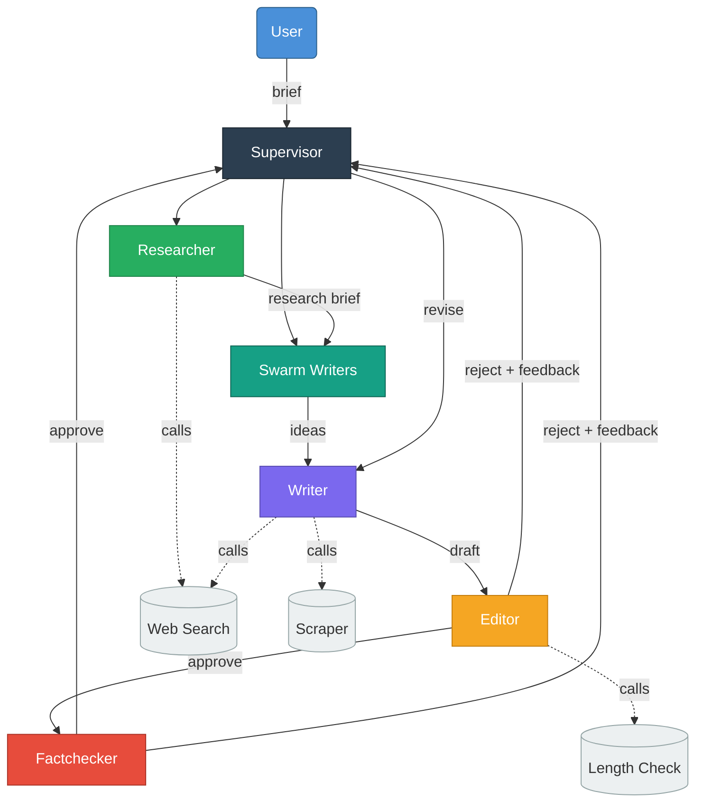

```mermaid
flowchart TD
    User(User) -->|brief| Supervisor[Supervisor]
    Supervisor --> Researcher[Researcher]
    Supervisor --> Swarm[Swarm Writers]
    Researcher -->|research brief| Swarm
    Swarm -->|ideas| Writer[Writer]
    Writer -->|draft| Editor[Editor]
    Editor -->|approve| Factchecker[Factchecker]
    Editor -->|reject + feedback| Supervisor
    Factchecker -->|approve| Supervisor
    Factchecker -->|reject + feedback| Supervisor
    Supervisor -->|revise| Writer

    Researcher -.->|calls| WebSearch[(Web Search)]
    Writer -.->|calls| Scraper[(Scraper)]
    Writer -.->|calls| WebSearch
    Editor -.->|calls| LengthCheck[(Length Check)]

    style User fill:#4A90D9,stroke:#2C5F8A,color:#fff
    style Supervisor fill:#2C3E50,stroke:#1A252F,color:#fff
    style Researcher fill:#27AE60,stroke:#1E8449,color:#fff
    style Swarm fill:#16A085,stroke:#0E6655,color:#fff
    style Writer fill:#7B68EE,stroke:#5A4DB0,color:#fff
    style Editor fill:#F5A623,stroke:#C47D0E,color:#fff
    style Factchecker fill:#E74C3C,stroke:#A93226,color:#fff
    style WebSearch fill:#ECF0F1,stroke:#95A5A6,color:#333
    style Scraper fill:#ECF0F1,stroke:#95A5A6,color:#333
    style LengthCheck fill:#ECF0F1,stroke:#95A5A6,color:#333
```

